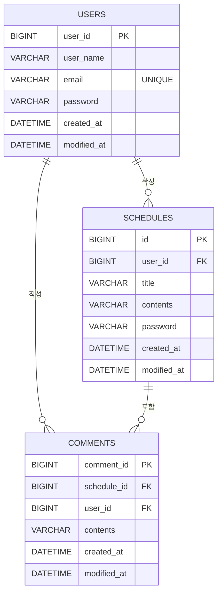

# 📅 일정 관리 앱 (심화)

> 부트캠프 Spring 심화 과제로 만든 일정 관리 API 서버입니다.  
> 기본 일정 CRUD에 **회원가입, 세션 기반 로그인, 댓글 기능**을 더하고, 유저·일정·댓글 간 연관관계를 JPA로 설계했습니다.

<br>

## 📌 프로젝트 정보

| 항목 | 내용 |
| --- | --- |
| 기간 | 2026.07.03 ~ 2026.07.09 |
| 인원 | 개인 과제 |
| 구분 | 캠프 Spring 심화 과제 |
| 이전 버전 | [일정 관리 API (기본)](https://github.com/tls123qwe/spring-schedule-api) |

<br>

## 🛠 Tech Stack


<br>

## ✨ 주요 기능

- **회원 관리**: 회원가입(이메일 중복 검사), 유저 조회·수정·삭제
- **인증**: `HttpSession` 기반 로그인 / 로그아웃
- **일정 관리**: 로그인한 유저 정보로 일정 생성, 전체·단건·유저별 조회, 작성자 본인만 수정
- **댓글 관리**: 로그인한 유저가 일정에 댓글 작성, 일정별 댓글 조회·수정·삭제
- **일정 조회 시 댓글 포함**: 일정 응답에 해당 일정의 댓글 목록을 함께 반환

<br>

## 📂 프로젝트 구조

```
src/main/java/com/example/scheduleapp_develop
├── controller   # Auth, User, Schedule, Comment API
├── service      # 비즈니스 로직 (세션 확인, 권한·비밀번호 검증, DTO 변환)
├── repository   # JPA Repository, 쿼리 메서드
├── entity       # User, Schedule, Comment, BaseEntity(생성·수정 시간)
└── dto          # 도메인별 요청/응답 DTO (auth, user, schedule, comment)
```

<br>

## 🗂 ERD



<br>

## 📡 API 명세

🔒 표시는 로그인(세션)이 필요한 API입니다.

### 인증
| 기능 | Method | URL | 성공 응답 |
| --- | --- | --- | --- |
| 회원가입 | POST | `/auth/signup` | 201 Created |
| 로그인 | POST | `/auth/login` | 200 OK |
| 로그아웃 | POST | `/auth/logout` | 204 No Content |

### 유저
| 기능 | Method | URL | 성공 응답 |
| --- | --- | --- | --- |
| 전체 조회 | GET | `/users` | 200 OK |
| 단건 조회 | GET | `/users/{userId}` | 200 OK |
| 수정 | PUT | `/users/{userId}` | 200 OK |
| 삭제 | DELETE | `/users/{userId}` | 204 No Content |

### 일정
| 기능 | Method | URL | 성공 응답 |
| --- | --- | --- | --- |
| 생성 🔒 | POST | `/schedules` | 201 Created |
| 전체 조회 | GET | `/schedules` | 200 OK |
| 단건 조회 | GET | `/schedules/{scheduleId}` | 200 OK |
| 유저별 조회 | GET | `/users/{userId}/schedules` | 200 OK |
| 수정 🔒 | PUT | `/schedules/{scheduleId}` | 200 OK |
| 삭제 | DELETE | `/schedules/{scheduleId}` | 204 No Content |

### 댓글
| 기능 | Method | URL | 성공 응답 |
| --- | --- | --- | --- |
| 생성 🔒 | POST | `/schedules/{scheduleId}/comments` | 201 Created |
| 일정별 조회 | GET | `/schedules/{scheduleId}/comments` | 200 OK |
| 단건 조회 | GET | `/schedules/{scheduleId}/comments/{commentId}` | 200 OK |
| 수정 | PUT | `/schedules/{scheduleId}/comments/{commentId}` | 200 OK |
| 삭제 | DELETE | `/schedules/{scheduleId}/comments/{commentId}` | 204 No Content |

요청·응답 예시는 [API 상세 명세](./docs/API.md)에서 확인할 수 있습니다.

<br>

## 💡 구현 포인트

### 1. 세션 기반 로그인
로그인에 성공하면 세션에 **유저 ID만** 저장하고, 일정·댓글 생성 시 세션에서 유저 ID를 꺼내 작성자를 지정합니다.  
요청 바디로 작성자를 받지 않기 때문에, 다른 사람 이름으로 일정을 만드는 것을 막을 수 있습니다.

```java
// 로그인 성공 시
HttpSession session = servletRequest.getSession();
session.setAttribute("LOGIN_USER", userId);

// 일정 생성 시
HttpSession session = servletRequest.getSession(false); // 없으면 새로 만들지 않음
if (session == null || session.getAttribute("LOGIN_USER") == null) {
    throw new IllegalArgumentException("로그인이 필요합니다.");
}
```

### 2. 작성자 권한 + 비밀번호 이중 검증
일정 수정 시 **로그인한 유저가 작성자인지** 먼저 확인하고, 그다음 **일정 비밀번호**를 검증합니다.

### 3. JPA 연관관계 설계
`Schedule → User`, `Comment → User`, `Comment → Schedule`을 `@ManyToOne(fetch = LAZY)`로 매핑하고,  
`Schedule`에는 `@OneToMany(mappedBy = "schedule")`로 댓글 목록을 양방향으로 연결해 일정 조회 시 댓글을 함께 반환했습니다.

### 4. 브랜치 기반 기능 개발
`UserCRUD`, `LoginSetting`, `Comment` 등 기능 단위로 브랜치를 나눠 작업하고, Pull Request로 `main`에 병합했습니다.

<br>

## 🔧 트러블슈팅

### 댓글 조회 API가 동작하지 않고, 다른 일정의 댓글까지 조회되던 문제

**문제**  
댓글 조회·수정·삭제 API를 호출하면 404가 발생했고, 댓글 목록 조회 로직은 어떤 일정을 요청하든 **전체 댓글**을 반환하고 있었습니다.

**원인**  
1. 컨트롤러 URL이 `/Schedules/...`로 대문자로 작성되어 있었는데, Spring의 URL 매핑은 대소문자를 구분하기 때문에 `/schedules/...` 요청과 매칭되지 않았습니다.  
2. URL에 `{scheduleId}`가 있었지만 `@PathVariable`로 받지 않았고, 서비스에서도 `findAll()`로 전체 댓글을 조회하고 있었습니다.

**해결**  
URL을 소문자로 통일하고, `scheduleId`를 `@PathVariable`로 받아 쿼리 메서드로 해당 일정의 댓글만 조회하도록 수정했습니다.

```java
// Before
@GetMapping("/Schedules/{scheduleId}/comments")
public ResponseEntity<List<GetCommentResponse>> getAllComments() {
    return ResponseEntity.ok(commentService.getAllComments()); // findAll()
}

// After
@GetMapping("/schedules/{scheduleId}/comments")
public ResponseEntity<List<GetCommentResponse>> getAllComments(@PathVariable Long scheduleId) {
    return ResponseEntity.ok(commentService.getAllComments(scheduleId)); // findByScheduleId()
}
```

**배운 점**  
URL에 경로 변수를 적는 것만으로는 값이 전달되지 않으며, 컨트롤러 파라미터와 서비스 로직까지 일관되게 연결해야 한다는 것을 확인했습니다.

<br>

## 🚀 실행 방법

1. MySQL에 데이터베이스를 생성합니다.
   ```sql
   CREATE DATABASE users;
   ```
2. 환경 변수로 DB 접속 정보를 설정합니다.
   ```bash
   export DB_USERNAME=root
   export DB_PASSWORD=your_password
   ```
3. 애플리케이션을 실행합니다.
   ```bash
   git clone https://github.com/tls123qwe/spring-schedule-app.git
   cd spring-schedule-app
   ./gradlew bootRun
   ```

<br>

## 📈 개선 예정

- [ ] `@RestControllerAdvice`로 예외를 상태 코드(400, 401, 403, 404)에 맞게 응답
- [ ] 비밀번호 암호화 저장 (`PasswordEncoder`, BCrypt)
- [ ] 요청 DTO에 `@NotBlank`, `@Email`, `@Size` 검증 추가
- [ ] 세션 확인 로직을 Filter 또는 Interceptor로 분리
- [ ] 일정 삭제, 댓글 수정·삭제에도 작성자 권한 검증 적용
- [ ] 일정·유저 삭제 시 연관된 댓글·일정 처리 (cascade / orphanRemoval)
- [ ] 전체 일정 조회 시 발생하는 N+1 문제 개선 (fetch join)
- [ ] 페이징 조회

<br>

## 📝 회고

기본 일정 관리 과제에서 한 단계 나아가, 여러 엔티티 간의 연관관계를 직접 설계하고 세션으로 인증을 구현해본 과제였습니다.  
특히 기능별로 브랜치를 나누고 PR로 병합하는 흐름을 처음 적용해보면서, 작업 단위를 나누는 것이 코드 관리에 얼마나 도움이 되는지 느꼈습니다.
